# handytool
css and js plugins

## [bind key for music](https://github.com/eddy0/handytool/tree/master/keybind)
http://htmlpreview.github.io/?https://github.com/eddy0/handytool/blob/master/keybind/index.html

## [clock](https://github.com/eddy0/handytool/tree/master/clock)
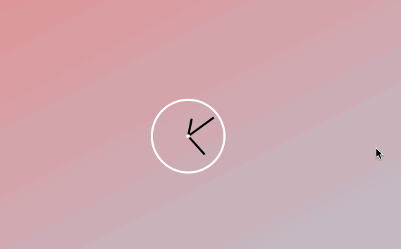

## [css carouser](https://github.com/eddy0/handytool/tree/master/flexGallery)
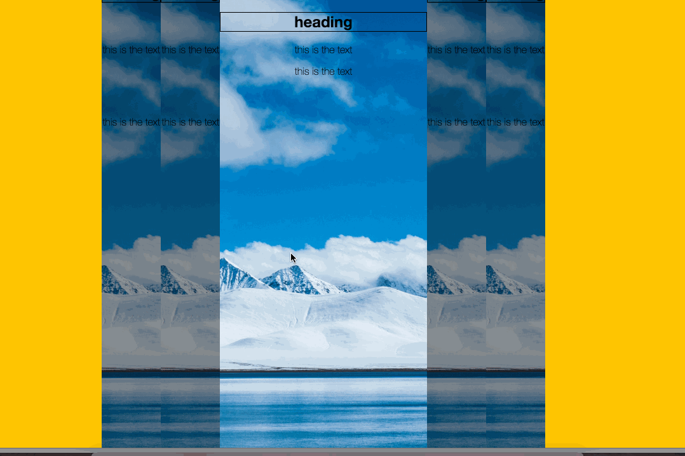

## [mutiSelect when shift](https://github.com/eddy0/handytool/tree/master/mutiSelect)
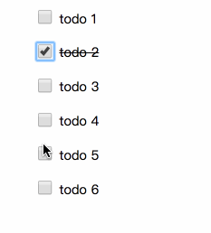

## [dynamic text shadow offset when mouse move](https://github.com/eddy0/handytool/tree/master/dynamicTextShadow)
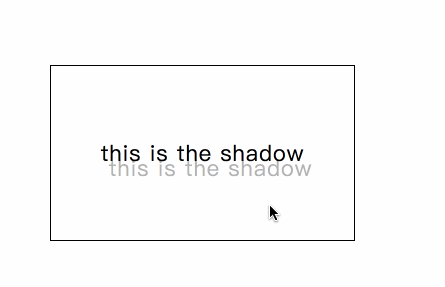

## [have fun with webcam ](https://github.com/eddy0/handytool/tree/master/video)

## [highlight when hover on the a tag ](https://github.com/eddy0/handytool/tree/master/highlightonHover)
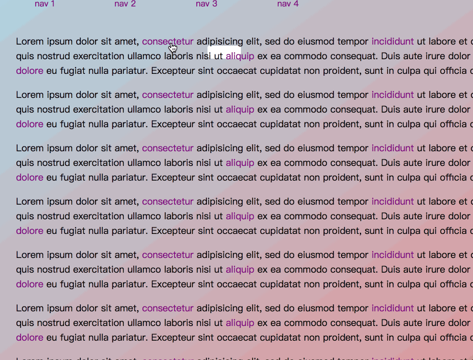

## [stickyNav when scroll ](https://github.com/eddy0/handytool/tree/master/stickyNav)
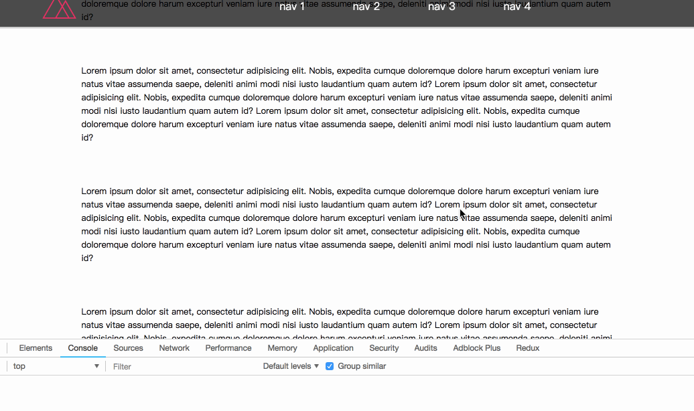

## 
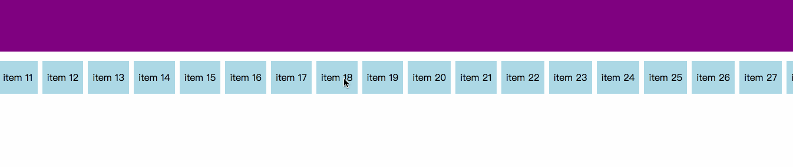

[demo](https://eddy0.github.io/handytool/scroll/index.html)

## 
[demo](https://eddy0.github.io/handytool/speechRecognition/index.html)

## 
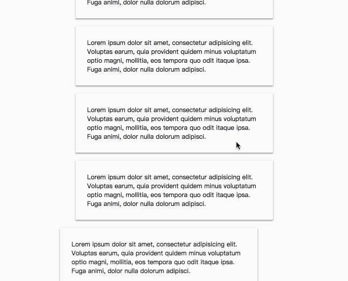

[demo](https://eddy0.github.io/handytool/scrollToShow/index.html)

## 

[demo](https://eddy0.github.io/handytool/hoverToShow/index.html)

## 
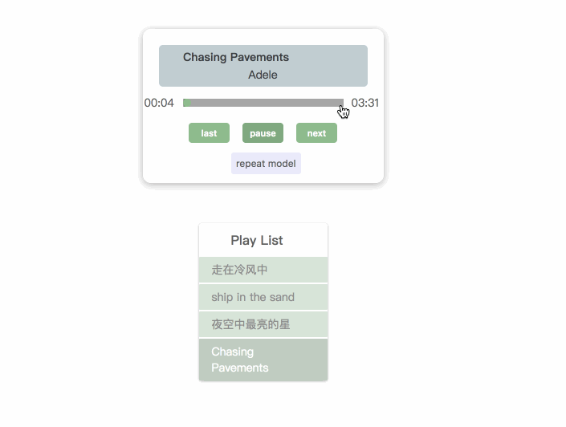

[demo](https://eddy0.github.io/handytool/musicplayer/index.html)

## 

[demo](https://eddy0.github.io/handytool/typeEffect/index.html)

## 

[demo](https://eddy0.github.io/handytool/loading/index.html)

## 

[demo](https://eddy0.github.io/handytool/countdown/index.html)

## 

[demo](https://eddy0.github.io/handytool/reactAnimation/index.html)

## 
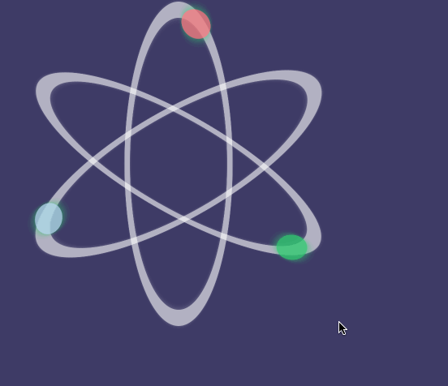

[demo](https://eddy0.github.io/handytool/reactIcon/index.html)

## 

[demo](https://eddy0.github.io/handytool/moveTextOnScroll/index.html)

## 
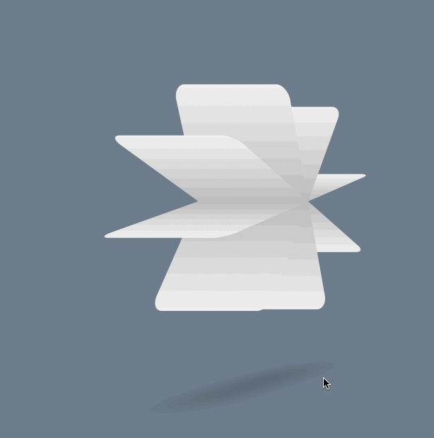

[demo](https://eddy0.github.io/handytool/3Danimation/3dGear.html)

## 
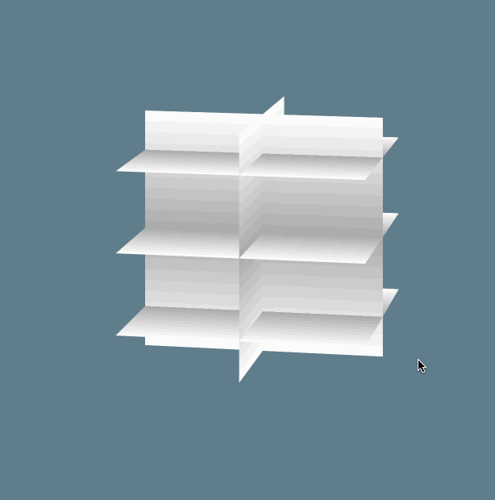

[demo](https://eddy0.github.io/handytool/3Danimation/3dsquare.html)

## 

[demo](https://eddy0.github.io/handytool/3Danimation/3dRotate.html)

## 

[demo](https://eddy0.github.io/handytool/cssHoverEffect/index.html)

## 

[demo](https://eddy0.github.io/handytool/cloudAnimation/index.html)

## 

[demo](https://eddy0.github.io/handytool/smokeEffect/index.html)

## [smokeEffect](https://github.com/eddy0/handytool/tree/master/splitImage/index.html)

[demo](https://eddy0.github.io/handytool/splitImage/index.html)

## [indicator](https://github.com/eddy0/handytool/tree/master/indicators/index.html)

[demo](https://eddy0.github.io/handytool/indicator/index.html)

## [slider](https://github.com/eddy0/handytool/tree/master/slider/index.html)

[demo](https://eddy0.github.io/handytool/slider/index.html)

## [buttonHover](https://github.com/eddy0/handytool/tree/master/buttonHover/index.html)
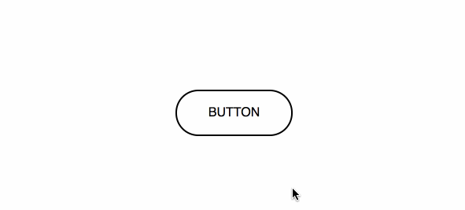

[demo](https://eddy0.github.io/handytool/buttonHover/index.html)

## [svgAnimation](https://github.com/eddy0/handytool/tree/master/svgAnimation/index.html)
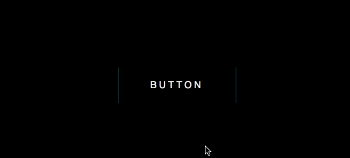

[demo](https://eddy0.github.io/handytool/svgAnimation/index.html)
